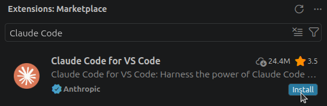
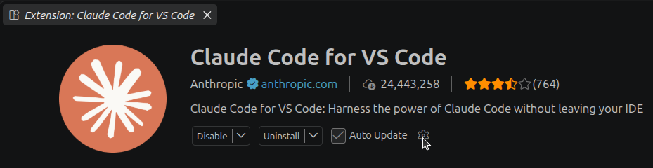
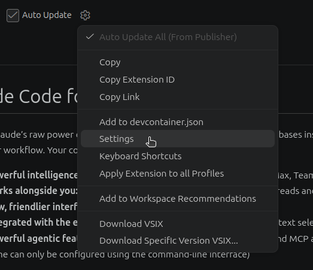
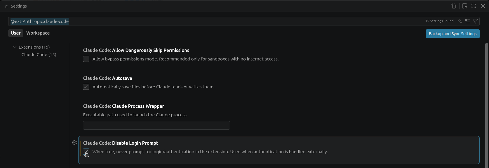
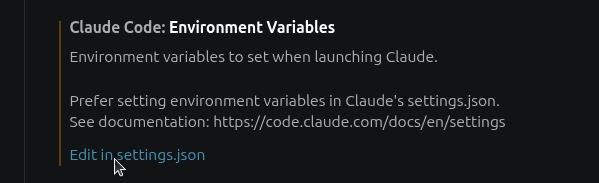
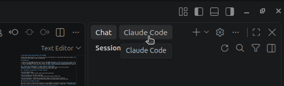
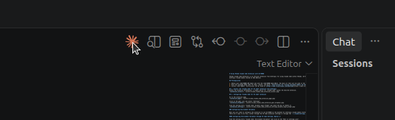

# Using VSCode Claude Code Extension with AI-VERDE

VSCode Claude Code Extension is an official extension from Anthropic for using Claude Code within VSCode. AI-VERDE can serve as the backend for the extension, routing requests through AI-VERDE's budget controls and guardrails to Anthropic Claude models hosted on AWS Bedrock.

## Prerequisites

1. Obtain your **AI-VERDE API key** and note the **AI-VERDE base URL**. The base url that will be used in the environment variables will be set with `/bedrock` rather than `/v1`[Instructions can be found here](api-token.md).
2. Note the **Claude model ID** for Opus, Sonnet, and Haiku. [Instructions for listing available models can be found here](api-key-models.md).
3. Install **VS Code**. Instructions can be found at [https://code.visualstudio.com/download](https://code.visualstudio.com/download).

## 1. Install the "Claude Code for VS Code" extension from Anthropic
Within the extension marketplace, a simple search for "Claude Code" yields the desired extension.


## 2. Configuring "Claude Code for VS Code" extension

Go to the extension page.


Click on the gear icon and select "Settings".


Find the setting entry "Claude Code: Disable Login Prompt" and check the box to enable it.


### Configuring Environment Variables

Next you will need to configure the extension to use AI-VERDE as the backend for Anthropic Claude models hosted on AWS Bedrock.
There are 2 ways to do this, either through the VS Code extension settings or through the `~/.claude/settings.json` file.

#### Configuring Environment Variables through VS Code Settings (Option 1)

Find the setting entry "Claude Code: Environment Variables" and click on the "Edit in settings.json".


You will need to add the following environment variables to the `claudeCode.environmentVariables` section of the settings:
- add your AI-VERDE API key as the ANTHROPIC_AUTH_TOKEN
- add your Bedrock base URL as ANTHROPIC_BEDROCK_BASE_URL
- replace the model IDs with your own team model IDs for Opus, Sonnet, and Haiku

```json
    "claudeCode.environmentVariables": [
        { "name": "ANTHROPIC_AUTH_TOKEN", "value": "REPLACE_WITH_YOUR_API_KEY"},
        { "name": "ANTHROPIC_BEDROCK_BASE_URL", "value":"REPLACE_WITH_YOUR_BEDROCK_BASE_URL"},
        { "name": "CLAUDE_CODE_SKIP_BEDROCK_AUTH", "value":"1"},
        { "name": "CLAUDE_CODE_USE_BEDROCK", "value":"1"},
        { "name": "ANTHROPIC_DEFAULT_OPUS_MODEL", "value":"my-team-claude-opus-4-6"},
        { "name": "ANTHROPIC_DEFAULT_SONNET_MODEL", "value":"my-team-claude-sonnet-4-6"},
        { "name": "ANTHROPIC_DEFAULT_HAIKU_MODEL", "value":"my-team-claude-haiku-4-5"}
    ],
```

!!! Note

    To obtain the AI-VERDE Bedrock Base URL, simply substitute `/v1` with `/bedrock`, e.g. https://llm-api.cyverse.ai/v1 to https://llm-api.cyverse.ai/bedrock.


#### Configuring Environment Variables through `~/.claude/settings.json` (Option 2)

Set environment variables in `~/.claude/settings.json`.

!!! Note

    Updating `~/.claude/settings.json` will impact your Claude Code CLI usage as well, so if you want to use the same settings for both the CLI and VS Code extension, this is the recommended approach.

You will need to add the following environment variables to the `env` section of the `~/.claude/settings.json` file:
- add your AI-VERDE API key as the ANTHROPIC_AUTH_TOKEN
- add your Bedrock base URL as ANTHROPIC_BEDROCK_BASE_URL
- replace the model IDs with your own team model IDs for Opus, Sonnet, and Haiku

```
"ANTHROPIC_AUTH_TOKEN": "REPLACE_WITH_YOUR_API_KEY",
"ANTHROPIC_BEDROCK_BASE_URL":"REPLACE_WITH_YOUR_BEDROCK_BASE_URL",
"CLAUDE_CODE_SKIP_BEDROCK_AUTH":"1",
"CLAUDE_CODE_USE_BEDROCK":"1",
"ANTHROPIC_DEFAULT_OPUS_MODEL":"my-team-claude-opus-4-6",
"ANTHROPIC_DEFAULT_SONNET_MODEL":"my-team-claude-sonnet-4-6",
"ANTHROPIC_DEFAULT_HAIKU_MODEL":"my-team-claude-haiku-4-5"
```

!!! Note

    To obtain the AI-VERDE Bedrock Base URL, simply substitute `/v1` with `/bedrock`, e.g. https://llm-api.cyverse.ai/v1 to https://llm-api.cyverse.ai/bedrock.


For example, your `~/.claude/settings.json` file might look like this:
```json
{
  "model": "opus",
  "enabledPlugins": {},
  "theme": "light"
}
```

Your `~/.claude/settings.json` file should look like this after adding the environment variables:
```json
{
  "model": "opus",
  "enabledPlugins": {},
  "env": {
    "ANTHROPIC_AUTH_TOKEN": "sk-xyz",
    "ANTHROPIC_BEDROCK_BASE_URL":"https://llm-api.cyverse.ai/bedrock",
    "CLAUDE_CODE_SKIP_BEDROCK_AUTH":"1",
    "CLAUDE_CODE_USE_BEDROCK":"1",
    "ANTHROPIC_DEFAULT_OPUS_MODEL":"my-team-claude-opus-4-6",
    "ANTHROPIC_DEFAULT_SONNET_MODEL":"my-team-claude-sonnet-4-6",
    "ANTHROPIC_DEFAULT_HAIKU_MODEL":"my-team-claude-haiku-4-5"
  },
  "theme": "light"
}
```

## 3. Restart VS Code

You may need to restart VS Code for the environment variables & settings to take effect.

## 4. Using the extension
The extension has chat functionality accessed from the leftmost bar in VS Code:


You can also open a chat window by clicking on the Claude logo:

